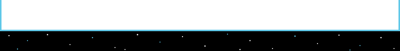

<br/>

<div align="center">

[](https://git.io/typing-svg)

</div>

<br/>

```
  CS Student          HEH · Mons, Belgium
  ETH Oxford          2025 & 2026 · Oxford University
  Focus               UI/UX · Blockchain · Creative Dev
  Outside             Cinéma · Skateboard · Montage vidéo
```

<br/>

---

### STACK

**Languages**


**Frontend**


**Tools**


---

### STATS

<div align="center">

  
</div>

---

### PROJECTS

| Project | Stack | |
|---|---|:---:|
| **Crypto Transaction System** | `Solidity` `Blockchain` `React` | [ETH Oxford 25/26 →](https://hugodvrs4.github.io/Lava-Payments) |
| **Homepage** | `React 19` `TypeScript` `Vite` | [Live →](https://spidermiriki.github.io/Homepage/) |
| **Melo's Studio** | `React` `Letterboxd API` | [Live →](https://spidermiriki.github.io/Melo-s-Studio/) |
| **VideoConf Hub** | `React 19` `Firebase` `YouTube API` | [Live →](https://spidermiriki.github.io/VideoConf-Hub/) |
| **Portfolio** | `React 19` `TypeScript` | [Live →](https://spidermiriki.github.io/Portfolio/) |

---

<div align="center">

[](https://spidermiriki.github.io/Portfolio/)&nbsp;&nbsp;
[](https://www.linkedin.com/in/derouck-homero)&nbsp;&nbsp;
[](https://spidermiriki.github.io/CV/)

</div>


